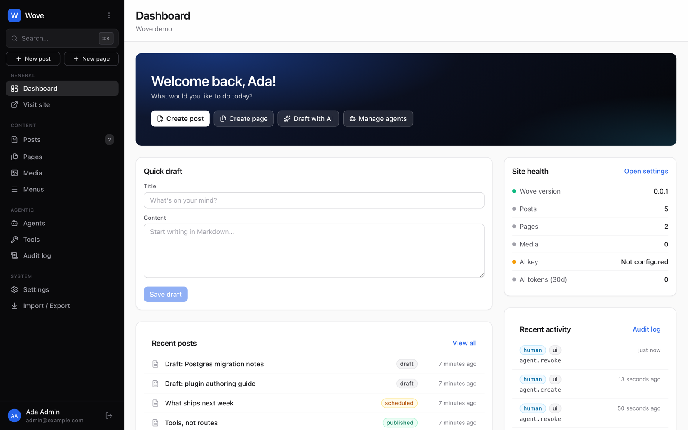
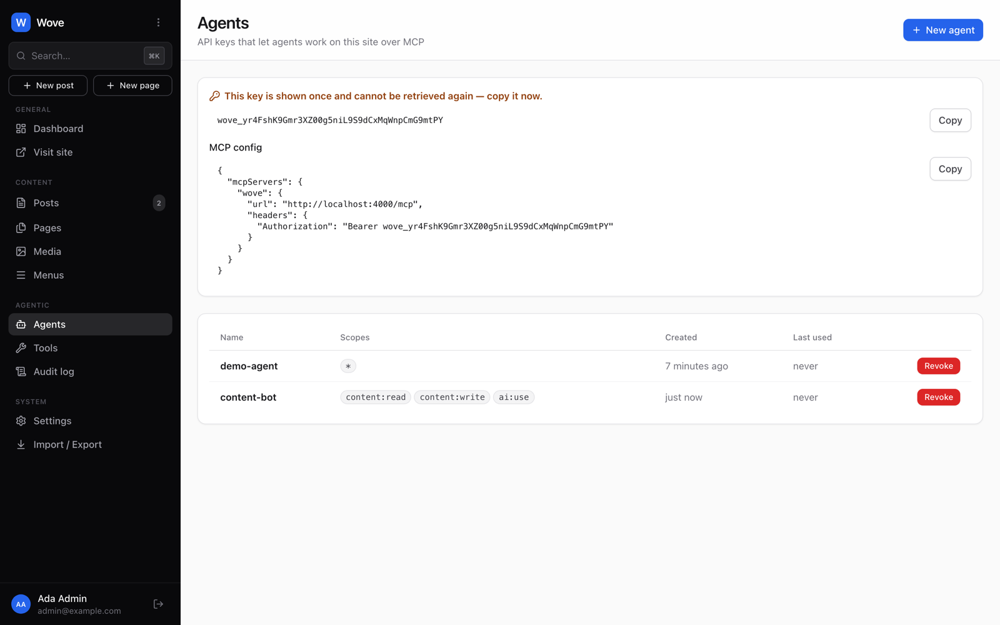
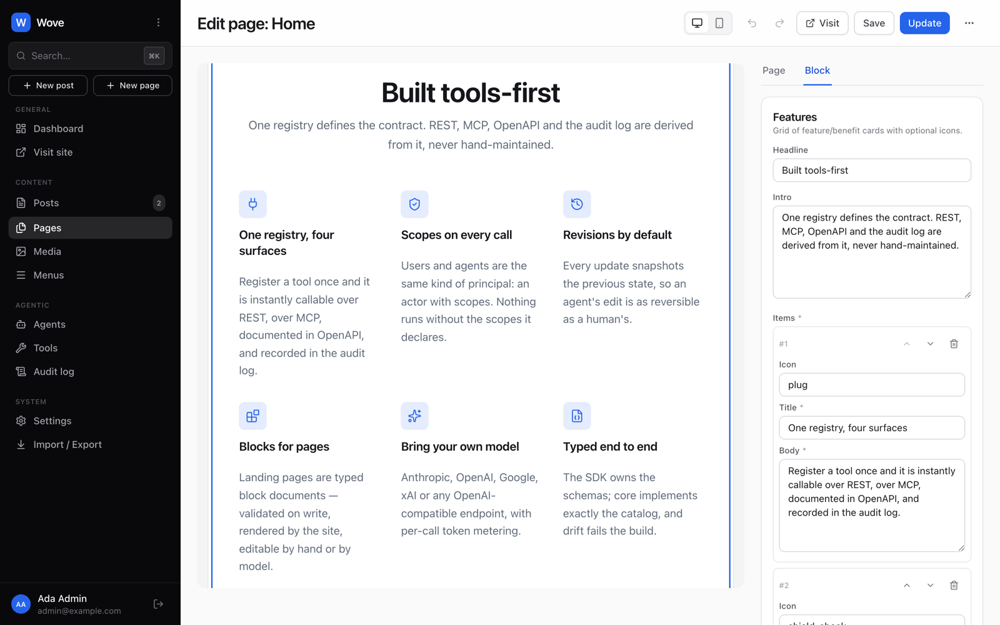
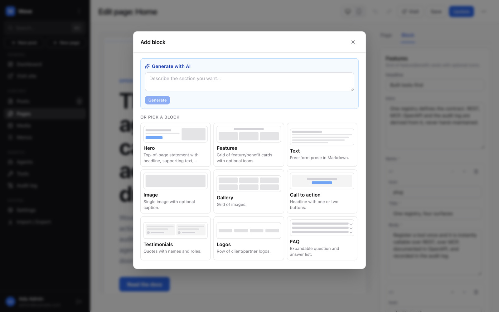
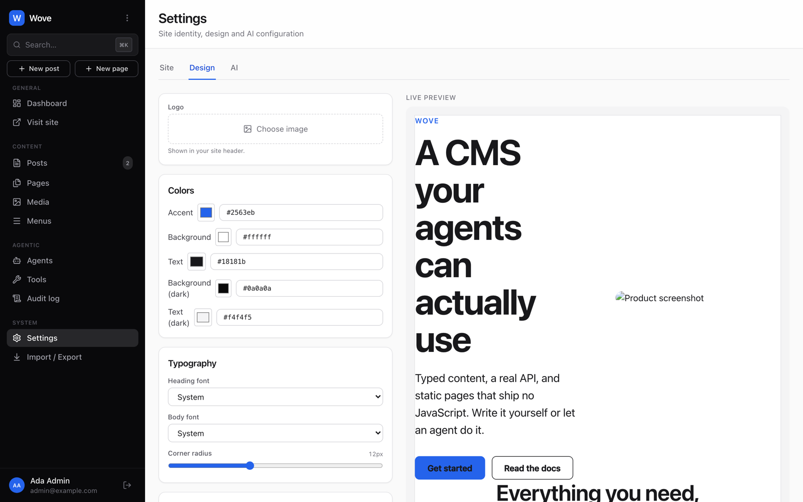
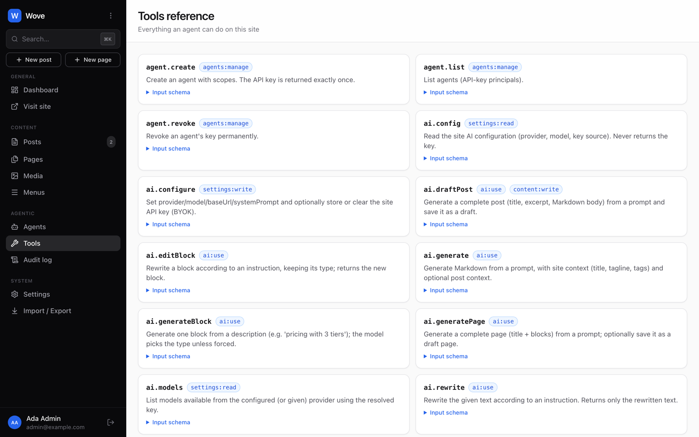
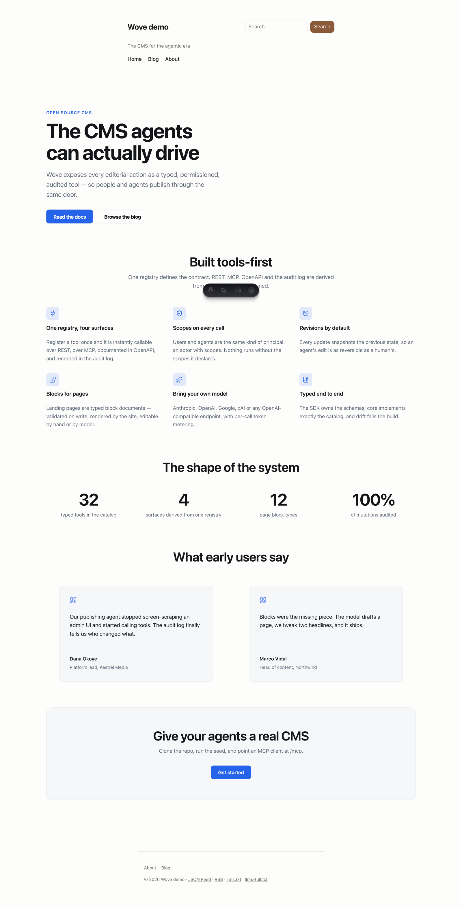

<p align="center">
  
</p>

<h1 align="center">Wove</h1>

<p align="center">
  <strong>The open-source CMS for the agentic era.</strong><br>
  Every publishing action is a typed, permissioned, audited <em>tool</em> — used by people through a modern admin, and by AI agents through MCP, on equal footing.
</p>

<p align="center">
  <a href="https://github.com/soyzamudio/wove/actions/workflows/ci.yml"></a>
  <a href="LICENSE"></a>
  
  <a href="https://github.com/soyzamudio/wove/releases"></a>
  <a href="https://usewove.com"></a>
</p>

---

## Why Wove

WordPress made publishing a human click-through experience. That model is ending: the next wave of sites will be drafted, restructured, and maintained by agents working alongside people.

Wove is built for that from the ground up:

- **One registry, four surfaces.** Every admin action — create a post, reorder the nav, change the accent color, generate a page — is a tool with a JSON schema. From that single registry Wove derives the **REST API**, the **MCP server**, the **OpenAPI spec**, and the **audit log**. The admin UI is just another client. Nothing the UI can do is hidden from agents.
- **Agents are first-class principals.** Create an agent, give it scopes (`content:write`, `ai:use`, …), hand it a key. Every action it takes is attributed and auditable, side by side with human actions.
- **AI is built in, not bolted on.** Bring your own key for Anthropic, OpenAI, Google, xAI, or any OpenAI-compatible endpoint (Ollama, OpenRouter…). Draft posts, rewrite selections, and generate whole pages — with token metering and no vendor lock-in.
- **Fast by default.** Bun + Hono API, SQLite that just works, and Astro-rendered public sites that ship **zero JavaScript** unless you opt in.
- **Agent-readable sites.** Every site publishes `llms.txt`, `llms-full.txt`, a JSON Feed, and a structured public API, so the agents visiting your site get the same content your readers do.

## Quick start

```sh
git clone https://github.com/soyzamudio/wove.git && cd wove
bun install
bun run --cwd packages/core seed   # demo content + admin@example.com / admin1234
bun run dev:core                   # http://localhost:4000  API + MCP
bun run dev:admin                  # http://localhost:5173  admin
bun run dev:site                   # http://localhost:4321  your site
```

Requires [Bun](https://bun.sh) 1.2+. No database server, no PHP, no build step for the public site's HTML.

## Connect an agent

In the admin, go to **Agents → New agent**, pick scopes, and copy the key. Then point any MCP client at Wove:

```json
{
  "mcpServers": {
    "wove": {
      "url": "http://localhost:4000/mcp",
      "headers": { "Authorization": "Bearer wove_…" }
    }
  }
}
```

Your agent now sees 40+ tools — `post.create`, `ai.generatePage`, `menu.set`, `design.update`, `import.wordpress`, and everything else the admin can do — each with a schema and a description. The same tools are one HTTP call away:

```sh
curl -X POST http://localhost:4000/api/tools/post.create \
  -H "Authorization: Bearer wove_…" -H "content-type: application/json" \
  -d '{"title":"Hello from an agent","content":"# It works\n\nWritten over REST.","status":"published"}'
```

<p align="center">
  
</p>

## What's inside

**Content**
- Posts in Markdown; pages as **typed block documents** built in a visual, AI-augmented builder
- Drafts, scheduling (with a real scheduler), trash & restore, bulk actions, revisions, autosave recovery
- Tags & categories, featured images, per-post SEO (title, description, OG image, noindex)
- Media library with automatic WebP renditions and `srcset`; local disk or any S3-compatible bucket

**Page builder**
- 12 designed section blocks — hero, features, CTA, testimonials, FAQ, stats, gallery, and more
- Drag to reorder, undo/redo, desktop/mobile preview, per-block property forms generated from the schema
- **Generate a page from a prompt**, **describe a section** to insert it, or **AI-edit** any block — all validated against the block schema
- One React renderer shared by the builder canvas and the Astro site: preview equals production, no client JS on the public page

<p align="center">
  
</p>

<p align="center">
  
</p>

**Site**
- Navigation menus, design settings (logo, colors, fonts, radius, custom CSS) applied through CSS variables — to the site *and* the builder canvas
- Public search, RSS + JSON Feed, sitemap, `llms.txt`
- Astro SSR, themeable via a single `@theme` alias

<p align="center">
  
</p>

**Agentic core**
- Tool registry → REST + MCP + OpenAPI + audit from one definition
- Scoped agents, session auth for humans, a full audit log (who, via which channel, what)
- Plugins are TypeScript modules that add tools and hooks — and their tools show up over MCP automatically
- **Import from WordPress** (WXR): posts, pages, media, tags, menus, featured images, Yoast/RankMath SEO — as a background job with a report

<p align="center">
  
</p>

**AI (bring your own key)**

| Provider | Models | Notes |
|---|---|---|
| Anthropic | Claude Opus / Sonnet | official SDK |
| OpenAI | GPT-5 family | official SDK |
| Google | Gemini | official SDK |
| xAI | Grok | OpenAI-compatible |
| OpenAI-compatible | anything | Ollama, LM Studio, OpenRouter… |

Keys are encrypted at rest and never returned by the API. Every call is metered (tokens, model, who, via what) — Wove records usage; it never prices it.

<p align="center">
  
</p>

## Migrating from WordPress

WordPress → **Tools → Export → All content**, then in Wove **Import / Export → Import from WordPress**. Media is downloaded through the normal pipeline (so it gets renditions), links and image URLs are rewritten, Gutenberg markup becomes clean Markdown, and re-runs are idempotent. Warnings (unsupported shortcodes, missing attachments, custom post types) are reported per item, never fatal.

## Architecture

```
packages/sdk      the contract: zod schemas + ToolCatalog + typed client
packages/core     Bun + Hono + Drizzle (SQLite) · tools · auth · hooks · MCP · AI · importer
packages/blocks   the shared React block renderer (+ plain CSS)
packages/admin    React admin (Vite, Tailwind)
packages/site     Astro SSR public site + default theme
apps/cloud        hosted edition — design docs only; open-core (ops + tenancy, never gated features)
```

**Adding a feature = adding a tool.** Declare it in `ToolCatalog`, implement it in `packages/core/src/tools/`, and it is available over REST, MCP, OpenAPI, and the audit log. Then wire the UI. See [`docs/ARCHITECTURE.md`](docs/ARCHITECTURE.md) and the [roadmap](docs/ROADMAP.md).

## Deploy

Wove ships as a single container — core, the admin (under `/admin`), and the
public site all run behind one port:

```sh
export WOVE_SECRET=$(openssl rand -hex 32) WOVE_SITE_URL=https://your-domain.example
docker compose up -d
```

See [`docs/DEPLOY.md`](docs/DEPLOY.md) for the full guide — Docker, a
VPS without Docker, reverse proxy/TLS, S3 media, and every environment
variable.

**Updating**: `docker compose pull && docker compose up -d`, or `bun run update` for a git install — details in [DEPLOY.md → Updating](docs/DEPLOY.md#updating).

## Status

Wove is early and moving fast. The core loop — write, build, publish, and let agents do the same — works end to end today. Multi-author workflows, roles, email, and collections (custom content types) are next; see the [roadmap](docs/ROADMAP.md). Expect breaking changes before 1.0.

## Hosted edition

[usewove.com](https://usewove.com) will offer zero-ops hosting, managed agent access, and optional metered AI — built on this exact codebase. The open-source core is complete on its own; the hosted edition adds operations and multi-tenancy, not features.

## Contributing

PRs welcome — see [CONTRIBUTING.md](CONTRIBUTING.md). Security issues: [SECURITY.md](SECURITY.md).

## License

[Apache-2.0](LICENSE)
